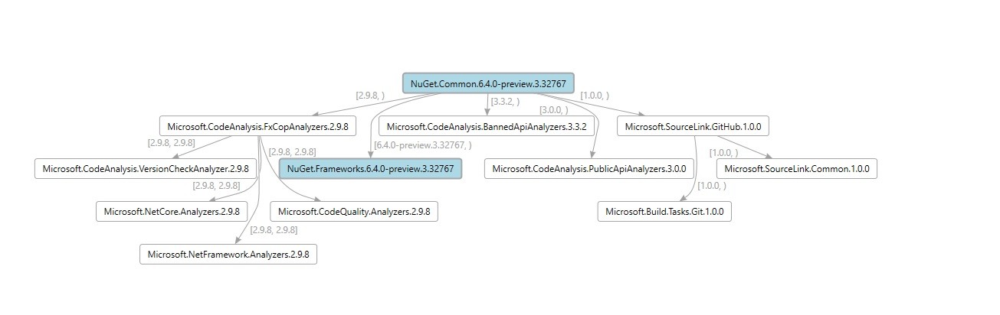

# Dependency Graph Visualizer tool

## Description

This tool helps visualize dependency graph for your project.
It can generate [.dgml](https://learn.microsoft.com/en-us/visualstudio/modeling/directed-graph-markup-language-dgml-reference?view=vs-2022) file(s) based on the dependency graph of your project.
The DGML file could be visualized as following:


- The light blude node represents project and its version.  
- The white node represents package and the resolved version.
- The number on the arrow represents the required [version range](https://learn.microsoft.com/en-us/nuget/concepts/package-versioning#version-ranges).

## How to use
### Preparation
   * Do solution restore or restore on a specific project.
   * Run this tool. 
   * Open the generated .dgml file(s) in Visual Studio with Graph Document Editor or other Editor which supports the visualization of DGML file.
     (You may set open with Graph Document Editor as default in Visual Studio so next time you just need to double click the .dgml file.)


### Synopsis

```
DependencyVisualizerTool <projectFilePath> [-h|--help][-o|--output]
```
#### Arguments:

##### projectFilePath
Specify path to the project file. This is positional argument so just put the path after 'DependencyVisualizerTool` command.

#### Options:

##### `-h|--help`

Show help information

##### `-o| --output`

Specify a folder to store the generated .dgml files. This is optional. 
* If it's not specified, it will be the project folder by default.
* If the folder is not created, the command will help you generate the folder.

#### Examples

Generate .dgml file(s) in default project folder:

`DependencyVisualizerTool.exe C:\repos\ProjectA\ProjectA.csproj`

Generate .dgml file(s) in a specified project folder:

`DependencyVisualizerTool.exe C:\repos\DependencyGraphFolder`

#### Notes
- The name of the .dgml file will be *projectName_TFM.dgml*
- For project with multiple TFMs(target frameworks), there will be multiple .dgml files generated.


## Feedback

File bugs in the [DependencyVisualizer](https://github.com/nkolev92/DependencyVisualizer)


