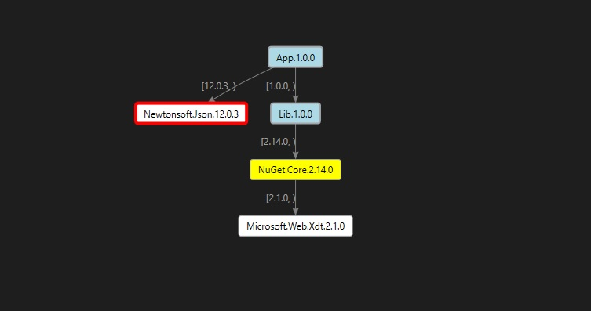

# Dependency Graph Visualizer tool

## Description

This tool helps visualize dependency graph for your project.
It can generate [.dgml](https://learn.microsoft.com/en-us/visualstudio/modeling/directed-graph-markup-language-dgml-reference?view=vs-2022) file(s) based on the dependency graph of your project.
The DGML file could be visualized as following:



- The light blue node represents project and its version.  
- The white node represents package and the resolved version.
- The number on the arrow represents the required [version range](https://learn.microsoft.com/en-us/nuget/concepts/package-versioning#version-ranges).
- A red border means that a package is vulnerable.
- A yellow background means that a package is deprecated.

## How to use

1. Do solution restore or restore on a specific project.
1. Run this tool (see Synopsis for more details about this tool).
1. Open the generated .dgml file(s) in Visual Studio with Graph Document Editor or other Editor which supports the visualization of DGML file.
    (You may set open with Graph Document Editor as default in Visual Studio so next time you just need to double click the .dgml file.)

### Synopsis

```console
Description:
  Dependency visualizer app

Usage:
  DependencyVisualizer <projectFilePath> [options]

Arguments:
  <projectFilePath>  Project file path.

Options:
  -o, --output <output>  Output folder path used to store generated graph file(s). By default, it's the project folder.
  --vulnerable           Whether to visualize the vulnerable packages in your package graph
  --deprecated           Whether to visualize the deprecated packages in your package graph
  --projects-only        When used, generates a projects only graph.
  --version              Show version information
  -?, -h, --help         Show help and usage information
```

#### Examples

Generate .dgml file(s) in default project folder:

`dotnet DependencyVisualizer C:\repos\ProjectA\ProjectA.csproj`

Generate .dgml file(s) in a specified project folder:

`DependencyVisualizerTool.exe C:\repos\ProjectA\ProjectA.csproj --output C:\repos\DependencyGraphFolder`

#### Notes

- The name of the .dgml file will be *projectName_TFM.dgml*
- For project with multiple target frameworks, there will be multiple .dgml files generated.

## Feedback

File bugs in the [DependencyVisualizer](https://github.com/nkolev92/DependencyVisualizer) repo
